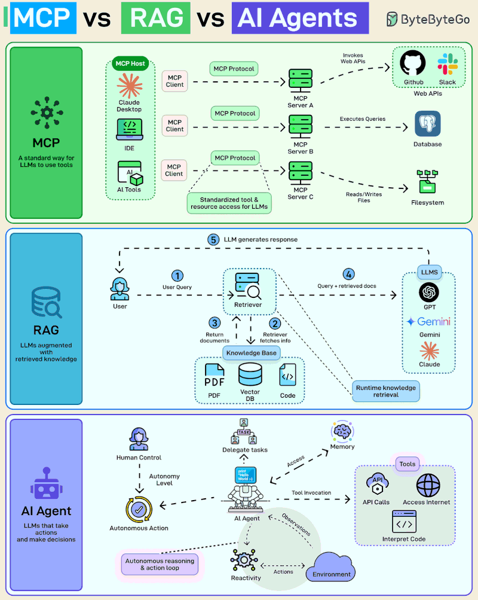

Simple Agent Demo



```js
import { ChatOllama } from "@langchain/ollama";

try {
    const model = new ChatOllama({
        model: "phi3:mini",
        baseUrl: "http://127.0.0.1:11434"
    });

    const res = await model.invoke("Hola desde LangChain JS");
    console.log(res.content);
} catch (error) {
    console.error("Error al conectar con Ollama:", error);
}
```