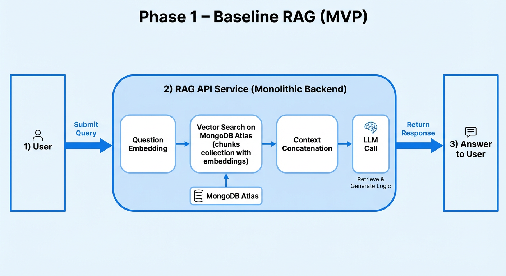
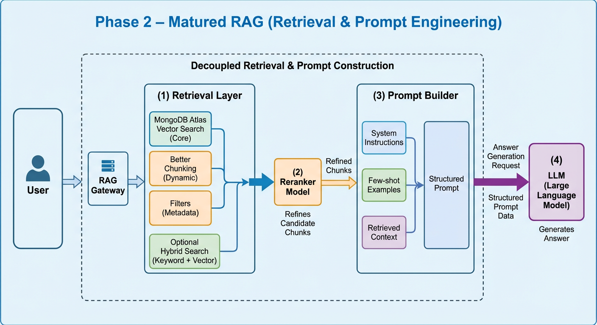
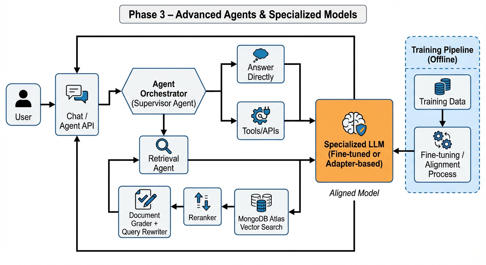

# Combining RAG and Model-Usage Patterns into a Practical Roadmap

When you design an LLM system (especially a RAG-based one), the question is not **“Which single pattern should I use?”** but:

> **In what order should I introduce retrieval patterns and model-usage patterns as my system matures?**

This article provides a **practical roadmap** for combining:

- **Retrieval / architecture patterns** (naive RAG, parent-document retrieval, hybrid search, filtered RAG, reranking, document-intelligence pipelines, agentic RAG, multi-tenant layouts).
- **Model-usage patterns** (zero-shot, few-shot, prompt engineering, fine-tuning, alignment, reranker models, tool calling).

We’ll walk through three phases that map well to real projects:

1. **Phase 1 – Baseline RAG:** get something working, fast.  
2. **Phase 2 – Retrieval & Prompt Maturity:** fix relevance, structure, and robustness.  
3. **Phase 3 – Advanced Agents & Model Adaptation:** add intelligence and domain specialization.

---

## 1. Phase 1 – Baseline RAG (MVP)

**Goal:**  
Ship a working, end‑to‑end RAG system that is *good enough* to test with real users and gather feedback.

### 1.1. Retrieval & architecture patterns

In this phase, keep the retrieval stack as simple as possible:

1. **Naive or classic chunking**  
   - Fixed-size chunks (e.g., by characters or tokens), maybe with light overlap.
   - Store `{ content, embedding, metadata }` in a single MongoDB collection with a Vector Search index.

2. **Single-stage Vector Search**
   - One `$vectorSearch` call on `embedding` to get top‑k chunks.
   - No reranking, no parent-document lookup yet.

3. **Basic filtering (if needed)**
   - A simple `filter` in `$vectorSearch` for `tenantId` or `language`, but don’t overcomplicate this yet.

4. **Monolithic RAG service**
   - One backend (e.g., Node.js) that:
     1. Receives the user question.
     2. Embeds it.
     3. Calls `$vectorSearch`.
     4. Concatenates chunks.
     5. Calls the LLM.
     6. Returns the answer.

### 1.2. Model-usage patterns

At this stage you want the **lowest friction**:

1. **Zero-shot prompting**
   - A single, clear system prompt:
     - “You are a helpful assistant. Answer strictly from CONTEXT. If the answer is not in CONTEXT, say you don’t know.”
   - The user question + concatenated context go as user content.

2. **Minimal prompt engineering**
   - Maybe enforce a basic structure:
     - “First summarize, then list steps”.
     - Or “Answer in English, then repeat the key point in Spanish”.

3. **No fine-tuning, no rerankers, no tools yet**
   - Your goal is **feature discovery**, not perfection.

### 1.3. Why this order?

- You learn quickly:
  - Does RAG solve the user problem?
  - What kinds of questions appear?
  - Where are the obvious failure modes?
- You don’t invest in expensive training or complex orchestration before knowing:
  - What the domain really needs.
  - Which retrieval and prompt choices matter.

**Exit criteria for Phase 1**

- You have:
  - A running RAG endpoint.
  - Logs of queries, retrieval results, and answers.
  - A basic human sense of “what’s going wrong”.

---

## 2. Phase 2 – Retrieval & Prompt Maturity

**Goal:**  
Fix the *obvious* problems in retrieval quality, grounding, and answer format **without** resorting immediately to training new models.

### 2.1. Retrieval patterns to add

Once you have basic telemetry, you’ll typically observe issues like:

- Relevant information exists but wasn’t retrieved.
- Retrieved chunks are noisy or too granular.
- Users see weird or chopped‑up context.

You address these primarily by enriching your **retrieval architecture**:

1. **Better chunking**
   - Move from naive/fixed-size chunking to:
     - Paragraph/section-based chunking.
     - Structure-aware chunking (headings, bullet lists, code blocks).
   - Optionally, start testing **contextualized chunk embeddings** (e.g., `voyage-context-3`) to capture both local detail and global document context.

2. **Parent-document retrieval**
   - Keep chunk-level embeddings for precision.
   - Add a parent-level document or section representation.
   - After vector search on chunks, fetch parent docs to:
     - give the LLM richer context,
     - display full documents in the UI.

3. **Filtered RAG**
   - Strengthen filters in `$vectorSearch`:
     - `tenantId`, `product`, `env`, `language`, `documentType`, etc.
   - This often solves “wrong customer/wrong region” issues better than any LLM tweak.

4. **Optional hybrid search**
   - If you see many keyword-driven queries (IDs, codes, error messages), add:
     - A full-text Atlas Search index,
     - Hybrid retrieval (vector + text) with a simple fusion step.

5. **Reranking (if needed)**
   - If top‑k from Vector Search still includes noise:
     - Retrieve `k_large` (e.g., 30),
     - Use a small reranker model or a cross-encoder to reorder,
     - Pass only top‑N to the LLM.

### 2.2. Model-usage patterns to add

In parallel, you mature the **prompt side** before touching weights:

1. **Full-fledged Prompt Engineering**
   - Introduce a **Prompt Builder component** that:
     - Merges system instructions, user query, retrieved context.
     - Optionally injects metadata (titles, product, language).
     - Applies consistent templates for answers (headings, bullet lists, JSON, etc.).

2. **Few-shot / in-context examples**
   - Capture **real production examples** where:
     - Zero-shot gave poor answers,
     - Or you want a very specific output format.
   - Add 2–5 high-quality examples into the prompt:
     - Show “good & grounded” answers.
     - Show what to do when context is missing (“explicitly say you don’t know”).

3. **Guardrails in prompts**
   - System-level constraints, like:
     - “Never reveal internal IDs or secrets.”
     - “Cite which document or section your answer came from.”

4. **Light use of tools/function calling**
   - If your LLM or framework supports it:
     - Wrap MongoDB Vector Search as a *tool* that the model can call.
     - At this phase, you still keep orchestration simple:
       - e.g., one retrieval call per user query.

### 2.3. Why this order?

- Many “model problems” are actually **retrieval problems**:
  - wrong chunks,
  - not enough context,
  - context from the wrong tenant.
- Many “need fine-tuning” instincts vanish after:
  - better chunking,
  - better filters,
  - better prompt templates.

You want to **squeeze everything you can** out of:

- Retrieval patterns,
- Prompt engineering,
- Few-shot examples,

before paying the complexity cost of training models.

**Exit criteria for Phase 2**

- Retrieval metrics (Recall@k, Precision@k) and answer quality have improved.
- Prompts are modular, versioned, and easier to tweak.
- You can point to *specific remaining gaps* that prompts and retrieval can’t fix.

---

## 3. Phase 3 – Advanced Agents & Model Adaptation

**Goal:**  
Handle more complex tasks and hard domain gaps, where you need:

- Multi-step decision-making,
- Self-correction loops,
- Or deeper domain specialization of the model itself.

### 3.1. Architectural upgrades: Agentic RAG & pipelines

Once basic RAG is solid, you can safely introduce **agentic behavior**:

1. **Agentic RAG with tool calling**
   - Wrap Vector Search, graders, and other APIs as tools.
   - Use an **agent/supervisor** model to:
     - Decide when to retrieve,
     - How to structure the query,
     - Whether to rewrite the query and try retrieval again.

2. **Retrieval agents and document graders**
   - Introduce components that:
     - Grade retrieved chunks for relevance.
     - Trigger query rewriting when context is weak.
   - This builds a **self-correcting loop**:
     - Query → Retrieve → Grade → (Rewrite query and retry) → Final context → Answer.

3. **Document-intelligence ingestion**
   - For complex sources (PDFs, scans, mixed media), deploy:
     - OCR & layout analysis,
     - Smart chunking,
     - Multimodal embeddings if needed.
   - This improves both retrieval and the *shape* of context.

4. **Multi-tenant / multi-index strategies**
   - Once scale grows, refine how you:
     - Partition data (tenants, domains),
     - Assign Vector Search indexes and search nodes,
     - Route queries per tenant.

### 3.2. Model adaptation: fine-tuning, alignment, specialized rerankers

At this point, the remaining issues usually fall into:

- Deep **domain gaps** (e.g., very niche legal, healthcare, or security content).
- Required **formats & reasoning** where base models still fail.
- Strong **policy / brand alignment** needs.

You then consider **training**:

1. **Supervised fine-tuning (SFT) or PEFT/LoRA**
   - Use real conversations, tickets, or curated Q&A pairs to:
     - Improve the model’s understanding of your domain.
     - Teach stable output formats and reasoning styles.
   - For RAG, often:
     - Fine-tune the *generator* on “RAG-flavored” examples:
       - Input = (question + context),
       - Output = grounded, cited answer.

2. **Train or adopt specialized reranking models**
   - If you need better ranking than generic embedding models provide:
     - Train a reranker on labeled (query, document, relevance) triples,
     - Or adopt a high-quality reranking API and treat it as a drop-in module.

3. **Alignment / preference optimization for your domain**
   - When safety, tone, and policy are critical:
     - Introduce some form of preference optimization (RLHF/DPO-like),
     - Or build a smaller gating/classification layer that checks/adjusts outputs.

4. **Advanced tools and workflows**
   - Add transactional tools:
     - ticket creation, workflow execution, code generation + tests, etc.
   - Your system becomes more of an **agentic orchestrator** with RAG as a core but not the only component.

### 3.3. Why this order?

- By Phase 3 you:
  - Know your data,
  - Have telemetry,
  - Understand where the base models break.
- This means your training targets are **concrete and testable**, not guesswork.
- You can calculate if the extra cost (infra, data labeling, MLOps) is justified.

**Exit criteria for Phase 3**

- You see clear, measurable gains from:
  - fine-tuning,
  - rerankers,
  - agentic loops,
  compared to your Phase‑2 baseline.
- You have monitoring, evaluation suites, and rollback paths for model changes.

---

## 4. Putting It All Together: A Combined Roadmap

Here’s how the patterns line up in a typical evolution:

### Step 1 – Ship quickly

- Retrieval:
  - Naive/classic chunking
  - Single-stage Vector Search
- Model usage:
  - Zero-shot prompting
  - Minimal prompt engineering

### Step 2 – Fix relevance and structure

- Retrieval:
  - Semantic / structure-aware chunking
  - Parent-document retrieval
  - Filtered RAG (metadata)
  - Optional hybrid search
  - Optional reranking
- Model usage:
  - Explicit Prompt Builder layer
  - Few-shot examples (in-context learning)
  - Stronger prompt guardrails
  - Light tool calling (e.g., explicit vector-search tool)

### Step 3 – Add intelligence and specialization

- Retrieval / architecture:
  - Agentic RAG (supervisor, retrieval agent, graders, rewriters)
  - Document-intelligence ingestion for complex docs
  - Multi-tenant and multi-index layouts
- Model usage:
  - Fine-tuned / PEFT-based specialized LLMs
  - Domain-specific rerankers
  - Alignment / preference optimization
  - Rich tool calling and workflow execution

---

## 5. Practical Advice for Choosing the Next Step

When deciding **what to add next**, ask:

1. **Are my failures mostly about not finding the right information?**
   - Start with **better retrieval**:
     - chunking,
     - filters,
     - parent-document retrieval,
     - hybrid search,
     - reranking.

2. **Are failures about how the answer is phrased, formatted, or reasoned?**
   - Improve **prompt engineering** and **few-shot examples**.
   - Only then consider **fine-tuning**.

3. **Are failures about data freshness or multi-step workflows?**
   - Add **tools** and **agentic orchestration** on top of RAG.

4. **Are failures about safety, tone, or policy?**
   - Strengthen:
     - system prompts,
     - guardrail classifiers,
     - and, when necessary, alignment / preference optimization.

By layering patterns in this order, you:

- Maximize impact per unit of complexity.
- Keep the architecture explainable and debuggable.
- Avoid prematurely investing in heavyweight training before you have solid retrieval and prompts.

This is how the full **“catalog” of patterns** works together in a real-world LLM and RAG system: not as competing options, but as **stages of sophistication** you unlock when your product and users demand it.