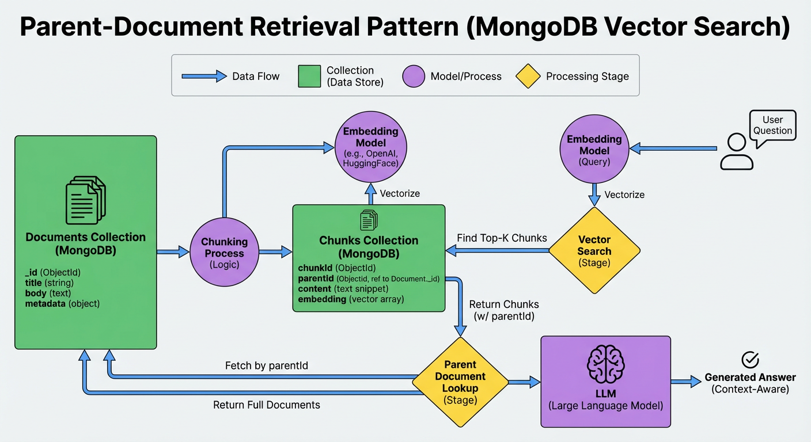
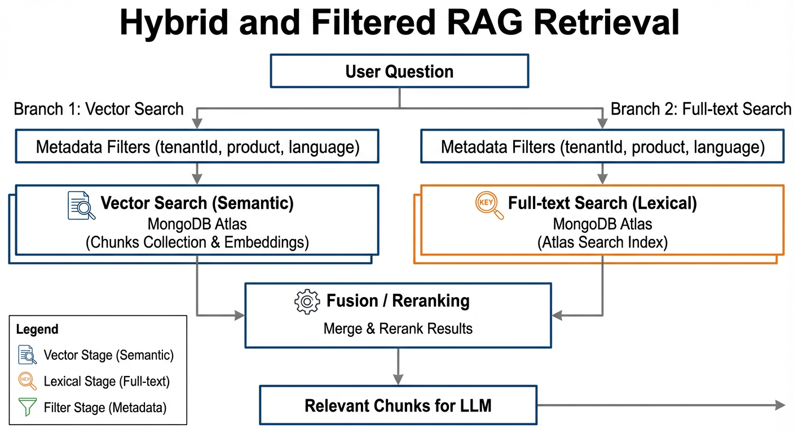
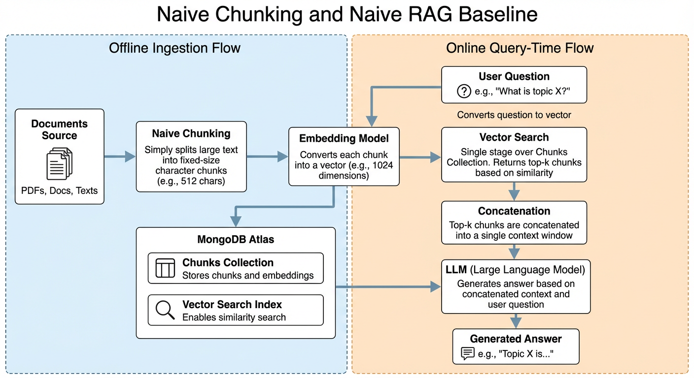
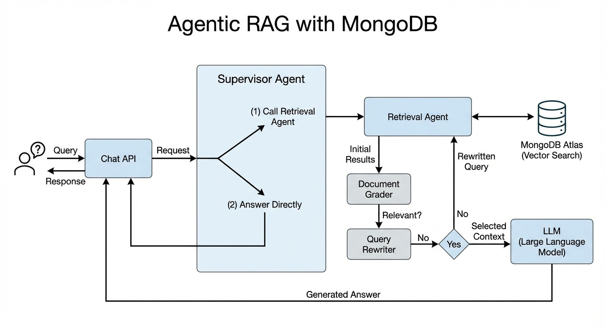
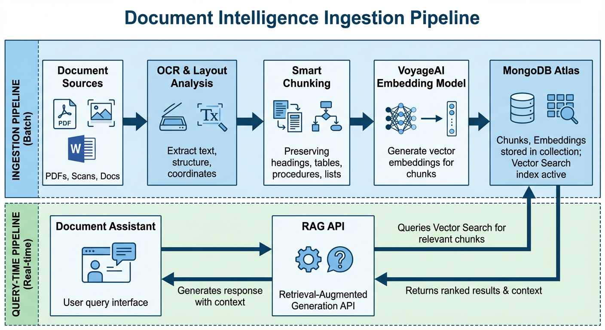

# Advanced RAG Solution Patterns with MongoDB Vector Search

Most teams start with a *naive RAG* setup:

1. Chunk documents.
2. Embed each chunk.
3. Store embeddings in a vector database (MongoDB Atlas Vector Search).
4. At query time, embed the question, run vector search, send top‑k chunks to the LLM.

This baseline works, but has clear limits in **relevance**, **latency**, **cost**, and **observability** once you go to production. This article walks through **solution patterns beyond naive RAG**, focused on MongoDB Atlas Vector Search and modern embedding models (including contextualized chunk embeddings like `voyage-context-3`).

---

## 1. Retrieval Patterns

### 1.1 Parent-Document Retrieval

**Problem**

- Chunks are good for retrieval, but bad for human readability:
  - Users and auditors usually care about **whole documents or sections**, not 5 disconnected snippets.
- If you send only tiny chunks to the LLM, you sometimes lose important **surrounding context** (definitions, assumptions, cross‑references).

**Idea**

Use **two levels of granularity**:

- Store and index **chunks** for precise vector search.
- Also keep a **parent document** representation, and when a chunk matches, pull back its parent (page, section, or full doc).

**Architecture**



**Collections**

- `documents` (parents)
  - `_id`
  - `title`
  - `body` (full text or section‑level text)
  - `metadata` (tags, product, tenant, etc.)
- `chunks`
  - `_id`
  - `parentId` → references `documents._id`
  - `content`
  - `embedding` (vector)
  - `metadata` (optional, e.g., `section`, `pageNumber`)

**Query-time flow**

1. Embed the **user question** with your embedding model.
2. Run `$vectorSearch` on `chunks.embedding` to get **top‑k chunks**.
3. Collect distinct `parentId` values from those chunks.
4. Fetch **parent documents** from `documents` (or join via `$lookup`).
5. Build LLM context from:
   - the selected chunks,
   - plus some extended text from their parents (full section / page).

**Benefits**

- Keeps vector search fine‑grained and efficient.
- Gives the LLM coherent, human‑meaningful context (not only truncated fragments).
- Simplifies UI: you can show full documents, highlight matched chunks, etc.

---

### 1.2 Hybrid Search (Vector + Full-text)

**Problem**

Semantic vector search alone is great for fuzzy queries, but:

- It can struggle with **hard keywords** (IDs, error codes, SKUs, function names).
- Sometimes you want **prefix / autocomplete / exact phrase** capabilities as well.

MongoDB has **two complementary engines**:

- **Atlas Vector Search** → semantic similarity on embeddings.
- **Atlas Search** → full-text, relevance scoring, faceting, autocomplete, etc.

**Idea**

Run **vector search and full-text search in parallel**, then **fuse or rerank** the results.

**Architecture**



**Flow**

1. Receive **user question**.
2. Branch 1 – **Vector Search**:
   - Embed the question.
   - Run `$vectorSearch` on your `chunks` collection.
3. Branch 2 – **Full-text Search**:
   - Run `$search` (e.g. `text`, `autocomplete`, `compound`) on the same or related collection.
4. Apply **metadata filters** in both branches:
   - `tenantId`, `product`, `language`, `env`, etc.
5. Combine results in a **fusion / reranking** step:
   - Simple: merge by ID and sum/weight scores.
   - Advanced: feed candidate chunks into a reranker model (e.g., Voyage reranker) to reorder them.
6. Send top‑N fused chunks to the LLM.

**Benefits**

- Lexical branch guarantees that **critical keywords** are not missed.
- Vector branch covers **semantic similarity** and paraphrases.
- Fusion/reranking gives you best of both worlds.

---

### 1.3 Filtered RAG (Metadata-aware Retrieval)

**Problem**

In multi‑tenant or multi‑domain systems:

- A query like “reset password policy” must be answered using **only the right tenant / product / environment**.
- Pure vector similarity might pull chunks from the wrong customer or region.

**Idea**

Treat metadata as **first-class filters** in vector search.

**Implementation with MongoDB Vector Search**

In your RAG collection, store:

```jsonc
{
  "content": "...chunk text...",
  "embedding": [...],
  "metadata": {
    "tenantId": "acme",
    "product": "billing",
    "language": "en",
    "env": "prod"
  }
}
```

Then use the `filter` option inside `$vectorSearch` to constrain the search space before similarity is computed.

```js
const pipeline = [
  {
    $vectorSearch: {
      index: 'rag_vector_index',
      path: 'embedding',
      queryVector: queryEmbedding,
      numCandidates: 200,
      limit: 5,
      filter: {
        'metadata.tenantId': tenantId,
        'metadata.product': product,
        'metadata.language': 'en'
      }
    }
  },
  {
    $project: {
      content: 1,
      metadata: 1,
      score: { $meta: 'vectorSearchScore' }
    }
  }
];
```

**Benefits**

- Strong **data isolation** and **security boundaries**.
- Higher relevance: the model searches only inside the right slice of the corpus.
- Easy to combine with hybrid search and parent-document retrieval.

---

### 1.4 Reranking Pipelines

**Problem**

Vector similarity is fast but not perfect:

- Top‑k results may contain **semantically close pero no exactos**.
- Sometimes you want *very high precision* in the final context you hand to the LLM.

**Idea**

Use a **two-stage retrieval**:

1. **Recall stage**: Vector Search (and optionally full-text) with a **generous k**, e.g., 20–50.
2. **Precision stage**: Reranking model that takes the **query + candidate chunks** and produces a better ordering.

You can use:

- A lightweight cross‑encoder / reranker model (e.g., Voyage reranker).
- A small local LLM for pairwise scoring (slower, but sometimes enough).

**Flow**

1. `$vectorSearch` → `k_large = 30` candidates.
2. For each candidate:
   - Create an input like `[QUERY] ... [CHUNK TEXT]`.
3. Feed all pairs into the reranker; get a relevance score per candidate.
4. Sort by reranker score, keep `k_final = 4–6`.
5. Send only those chunks to the main LLM.

**Benefits**

- Much higher **precision@k** without huge cost at the LLM level.
- You can tune `k_large` and `k_final` independently.

---

## 2. Chunking & Embedding Patterns

Chunking and embeddings are the foundation of retrieval quality.

### 2.1 Naive Chunking and Naive RAG Baseline

The **naive chunking + naive RAG** setup is the simplest possible end-to-end pattern. It is usually what you build first in a proof of concept.

#### Architecture



- **Offline ingestion flow**
  1. **Documents Source**: PDFs, docs, or raw text.
  2. **Naive Chunking**: split each large document into **fixed-size character chunks** (for example, 512–2000 characters), without looking at semantic structure.
  3. **Embedding Model**: for each chunk, call an embedding model (Voyage, OpenAI, etc.) to get a vector.
  4. **MongoDB Atlas**: store one document per chunk in a collection with fields like `{ content, embedding, metadata }` and a **Vector Search index** on `embedding`.

- **Online query-time flow**
  1. **User Question**: comes into your API.
  2. **Embedding Model**: compute the query embedding using the same model.
  3. **Vector Search**: run a single `$vectorSearch` stage over the chunks collection, request top‑k chunks.
  4. **Concatenation**: concatenate the retrieved chunks into one long context string.
  5. **LLM Call**: send `{ question, concatenatedContext }` to the LLM to generate an answer.

#### Characteristics

- **Pros**
  - Extremely simple to reason about and implement.
  - Great as a **baseline** to compare against more advanced patterns.
  - Good fit for quick demos and small knowledge bases.

- **Cons / Limitations**
  - Naive chunking ignores **semantic boundaries** (paragraphs, sections, code blocks), which can hurt retrieval quality.
  - Concatenating many chunks often leads to **noisy prompts** and higher token cost.
  - No notion of parent document, grading, query rewriting, or hybrid retrieval—just “top‑k chunks in, answer out”.

This baseline pattern is useful as a reference point: every other pattern in this article seeks to improve one or more of its weaknesses (retrieval quality, context coherence, cost, or robustness).

---

### 2.2 Classic Fixed-size Chunking with Overlap

**Pattern**

- Split documents in chunks of fixed length (chars or tokens), optionally with small overlap to avoid losing information at boundaries.

**Pros**

- Simple to implement.
- Works decently for many types of documentation.
- Easy to reason about sizing and token budgets.

**Cons**

- May **cut semantic units** (paragraphs, list items, code blocks) in the middle.
- Requires experimentation with chunk size and overlap.

**Typical choices**

- 300–700 tokens per chunk.
- 10–20% overlap if cutting by tokens.

---

### 2.3 Semantic / Structure-aware Chunking

**Pattern**

Chunk documents along **natural boundaries**:

- Headings and subheadings.
- Paragraphs and bullet lists.
- Code blocks, tables, diagrams.
- Sentence groups with semantic similarity.

You can:

- Use libraries like LangChain’s `RecursiveCharacterTextSplitter`, which tries to split along `\n\n`, `\n`, space, etc., only falling back to smaller cuts when necessary.
- Implement your own chunker based on markdown/HTML structure, or PDF layout analysis.

**Benefits**

- Each chunk is **semantically meaningful**:
  - “Configuration section”, “API method”, “troubleshooting steps”.
- Better retrieval recall and easier debugging:
  - When you inspect a chunk, it looks like something a person could read.

---

### 2.4 Contextualized Chunk Embeddings (voyage-context-3)

Traditional chunk embeddings:

- Encode **each chunk independently**, so they often lose the broader **document context**.
- You compensate by:
  - overlaps,
  - prepending metadata (titles, breadcrumb),
  - or manual summaries.

**Contextualized chunk embeddings** like `voyage-context-3` change this:

- The model sees **all chunks of a document in one pass** and produces **one embedding per chunk** that encodes:
  - local chunk content **and**
  - global document context.

**Key properties**

- Better retrieval at both **chunk-level** and **document-level** compared to classical embeddings.
- Less sensitive to chunk size and overlapped boundaries.
- Same number of vectors and dimensions as regular embeddings → **drop‑in replacement** in MongoDB Vector Search.

**How it plugs into Atlas Vector Search**

1. You still **store one embedding per chunk** (`embedding` field).
2. Define a **vectorSearch index** on `embedding`.
3. The main difference is in **how you call the embedding model**:
   - Instead of calling `embed(text)` per chunk, you send **all chunks of a document** to the contextualized model and get back enriched embeddings per chunk.

This pattern is particularly powerful for:

- long, dense, unstructured documents (legal, compliance, technical standards).

---

## 3. Architectural Patterns

### 3.1 Monolithic RAG Service (Baseline)

The simplest architecture:

- One **backend service** (e.g., Node.js) exposes `/rag/ask`.
- Inside that service:
  - embedding calls,
  - chunk retrieval (vector / hybrid),
  - prompt building,
  - LLM call,
  - logging.

This is effectively what most “quickstart” examples implement.

**Pros**

- Easy to build and deploy.
- Great for prototypes or single‑team ownership.

**Cons**

- Harder to scale specific hot spots (e.g., retrieval vs. LLM).
- Coupling between **ingestion, retrieval, generation, and evaluation** logic.

---

### 3.2 Agentic RAG (Supervisor, Retrieval Agent, Graders, Rewriters)

**Problem**

Naive RAG always:

- runs retrieval,
- sends retrieved chunks to the LLM as‑is,
- never questions if the results are actually relevant.

**Idea**

Introduce **agents** that can:

- decide when to retrieve,
- judge relevance,
- rewrite the query,
- loop until they have good context.

**Architecture**



**Roles**

- **Supervisor Agent**
  - Receives requests from the chat API.
  - Decides:
    - (1) call Retrieval Agent, or
    - (2) answer directly from parametric knowledge (no RAG).
- **Retrieval Agent**
  - Talks to MongoDB Atlas Vector Search over the `chunks` collection.
  - Returns candidate context.
- **Document Grader**
  - Evaluates if retrieved chunks are **actually relevant**.
  - If not, signals to rewrite / refine the query.
- **Query Rewriter**
  - Rephrases the user question or adds constraints.
  - Triggers another vector search until context is good enough.
- **LLM**
  - Generates the final answer once context has acceptable quality.

**Benefits**

- **Self‑correcting RAG**: the system can recognize bad retrieval and try again.
- Better suited for complex workflows (multi‑step questions, disambiguation, multiple data sources).

LangGraph + MongoDB is a common stack for implementing this pattern.

---

### 3.3 Document Intelligence Ingestion Pipeline

When your inputs are **complex documents** (PDFs, scans, forms, reports, diagrams), you often need a richer ingestion pipeline before RAG.

**Architecture**



**Ingestion pipeline (batch)**

1. **Document Sources**
   - PDFs, Word, scans, images, etc.
2. **OCR & Layout Analysis**
   - Extract text, structure (headings, tables, lists), and coordinates.
3. **Smart Chunking**
   - Preserve **logical units** (procedures, sections).
   - Attach layout/semantic metadata (`sectionTitle`, `pageNumber`, `bbox`, etc.).
4. **Embedding Model (e.g., VoyageAI)**
   - Generate embeddings for chunks (contextualized if needed).
5. **MongoDB Atlas**
   - Store chunks + embeddings in a collection.
   - Define a Vector Search index on `embedding`.

**Query-time pipeline (real‑time)**

1. **Document Assistant**
   - UI / API that accepts natural language questions.
2. **RAG API**
   - Embeds the question.
   - Queries Vector Search for relevant chunks.
   - Passes results to LLM.

This is the pattern described in MongoDB’s **Document Intelligence** solution architecture for agentic RAG.

---

### 3.4 Multi-tenant and Multi-index Patterns

**Problem**

- One cluster serves **many tenants** (customers, projects, teams).
- Each tenant should see **only their own data**, and you may want:
  - tenant-specific ranking,
  - custom embeddings per tenant.

**Patterns**

1. **Single collection, multi-tenant**
   - Store everything in one collection:
     ```jsonc
     {
       "content": "...",
       "embedding": [...],
       "tenantId": "acme",
       "space": "support-docs",
       ...
     }
     ```
   - Use `filter` in `$vectorSearch` to lock to a tenant / space.
   - Easiest operationally.

2. **Multiple views + indexes**
   - Keep a big base collection.
   - Define **views** per tenant/group (e.g., filtered by `tenantId`), and put **Vector Search indexes on views** (MongoDB 8+).
   - Lets you tune index settings and resources per logical segment.

3. **Per-tenant databases/collections**
   - Strongest isolation, but more operational overhead.
   - Good for high‑value or regulated tenants.

---

## 4. Putting It Together

In practice, robust RAG systems layer **several of these patterns**:

- **Retrieval**:
  - Hybrid + filtered vector search,
  - plus parent-document retrieval,
  - plus reranking.
- **Embeddings**:
  - Semantic/structure-aware chunking,
  - contextualized chunk embeddings for long docs.
- **Architecture**:
  - Monolithic RAG service at first,
  - evolving to agentic RAG with grading and query rewriting,
  - backed by a document intelligence ingestion pipeline where needed.

MongoDB Atlas Vector Search, together with modern embedding models like `voyage-context-3`, is designed to support exactly these patterns: semantic search, hybrid search, agentic RAG, and document intelligence workflows, all on top of a single operational data platform.

