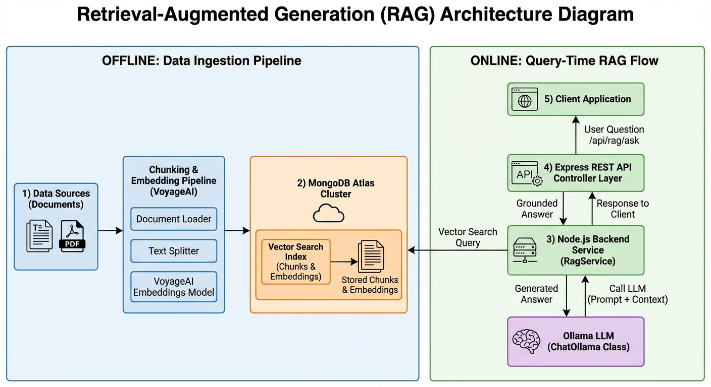

This document describes a Retrieval-Augmented Generation (RAG) architecture built on MongoDB Atlas Vector Search, Node.js 18+, LangChain, VoyageAI embeddings, and an Ollama LLM accessed via ChatOllama.

## High-Level Architecture

